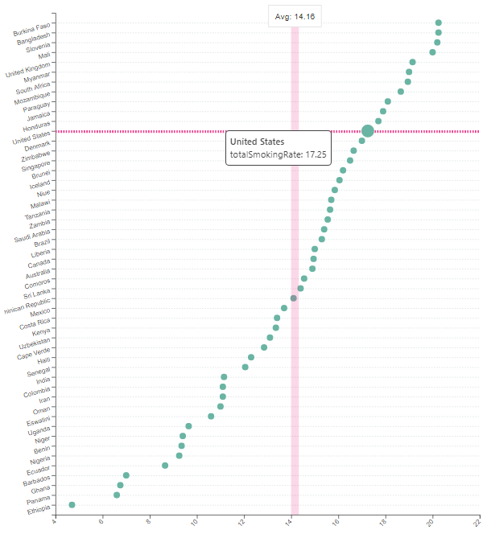
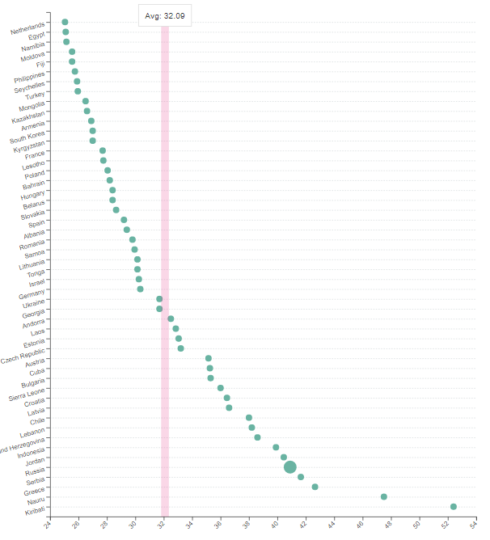

```{r setup, include=FALSE}
knitr::opts_chunk$set(echo = TRUE)
library(tidyverse)
```

<!-- This template is intended to help you structure your report. Remove placeholders like this and make it your own. Not every question needs to be answered for every project, and some projects will have additional questions. -->

## Overview

Original visualization:

```{r original-plot, echo=FALSE}
# Here is an example of how to include graphics in your report.
# See https://bookdown.org/yihui/rmarkdown-cookbook/figure-size.html for more details.
# You can use a URL ("Copy Image Address" etc.) or a file in your repo.
 

```

Claim:

> The tobacco prevalence  is affected by several factors. Properity is the first of these. Wealthier countries tend to smoke more. Certain religions such as Christianity and Judaism, are anti-tobacco. 


## Design

<!-- What overall type of visualization was chosen? Why might the author have chosen it? --> It seems like a scatter plot was used in this original visualization. Since there are over a hundred countries listed in the data set, the author may have thought the scatter plot is the best plot to represent numerous rows. 
<!-- What variables are being shown? --> The author could have labeled the country names on the x-axis, but to make it a easier to view, I think he or she labeled the country names on the y-axis and the total smoking rate on the x-axis. 
<!-- What retinal variables and/or aesthetics were chosen to represent those data variables? --> The dots or the points are presented in green and there are no specific size is assigned. When the viewer moves the cursor on a certain point, the total rate of that country shows up. The author also used lines in the background so that it is easy to follow which point belongs to which country. 
<!--     For at least one of these variables, describe what makes that choice appropriate or inappropriate. --> The author used all the country names in the plot. I think there could be an adjustment here. Although these country names are appropriate variables to use, there are too many to of them to show in one plot. Thus, I think we can reduce some countries, for example, filtering only the OECD countries. 
<!-- Overall, what about the visual makes it effective, or ineffective, for making its claim? --> The claim is clear and straightforward, but the visualization is not very effective. We can barely find any association between its claim and its visualization. For example, the original visualization does not really show how economic status or the religion of a country has affect on the smoking rate. 


## Data

### Data Overview

<!-- Whether you were able to find the original data (if not, why not?) --> I was able to find the original data, and found couple other data sets like gdp and religion and joined them into the original data set.  
<!-- Where the data came from --> The data sets of smoking rate came from the website which can be downloaded as a csv file: 
<!--     Direct URL and/or specific instructions for how to obtain it. --> https://worldpopulationreview.com/country-rankings/smoking-rates-by-country 
<!--     Under what terms is the source allowing you to use the data? --> This website allows anyone to download the data. Religion data was obtained from the same website: https://worldpopulationreview.com/country-rankings/religion-by-country which allows anyone to download as well. "world population review.com" originally updated and focused on the growing world population. However, as more researches were done with world population data, the website began to provide various kinds of data sets accessible to anyone. GDP data set was obtained from: https://data.oecd.org/gdp/gross-domestic-product-gdp.htm which also allows anyone to download its file. This website mainly focuses on the OECD (Organization for Economic C0-operation and Development) countries. Only a certain number of countries are the members of the OECD group.
<!--     Try to trace it upstream as close to the source as you can. --> 
<!--     Who worked with the data on its way to you? (Include names and roles, if applicable.) -->
<!--     What processing may have happened to it: was it aggregated? Anonymized? etc. --> The data sets seem to be collected in single files without aggregation with other files. Furthermore, no personal information was stored in the data set. 
<!-- What might we need to know about the data collection process in order to interpret the data correctly? (e.g., If it’s from a survey–who was surveyed?) --> The data was collected via several methods. Two methods are environmental measurements and biomakers. Environmental measurement is an objective data type that collects data through personal nicotine monitor or suspended particulates in air. Biomaker is also an objective data type that collects data through nicotine and cotinine in saliva, urine, and plasma. Self-report is a subjective data type that the data was collected through questionnaire and personal interview. To avoid biased information in the data, random people at various cities were surveyed. Most of the health-related data is collected by the employers of the HEDIS ( Healthcare Effectiveness Data and Information Set). 

### Data Details

<!-- A low-level description of the size and structure of the data (include your data-loading code here) --> 
<!-- What does each row represent? --> For smoking and gdp, each row represents country names in their initials. For religion, each row represents country names in their full names. 
<!-- How many rows are there? (use inline code: `r nrow(data)` etc.) --> nrow(smoking) = 115, nrow(gdp) = 115, nrow(religion) = 228
<!--   What might be interesting to know about what information the data does, and doesn’t, provide? --> The religion data set may be interesting to know whether or not the dominant religion of a certain country has affect on the smoking rate. 

```{r load-data, message=FALSE, paged.print=FALSE}
## Load data sets 
smoking <- read_csv('csvData.csv')
gdp <- read_csv('world_gdp.csv')
religion <- read_csv('world_religion.csv')
```

### Wrangling

<!-- Describe, at a broad level, what you need to do to the data to make it into the form you need for the plot. --> I will need to join religion and smoking data sets first because they have the full names of the countries. Then I will need to use gapminder::country_codes to add full country names to gdp data set that only has country abbreviations. In this process, I may need to manually go through the country names in gdp and gapminder::country_codes to find different names. Finally, I will join two data sets that will have both full names of and abbreviations with gdp and religion.   

<!-- Add code blocks, with appropriate names, for wrangling steps. -->
```{r}
## Rename columns and select useful columns of the gdp data set

gdp <- rename(gdp, gdp = Value, country = LOCATION) 
gdp <- gdp %>% 
  select(country, TIME, gdp)
  
```

```{r}
## Join smoking and religion data sets and omit any missing values.  

smoking_new <- smoking %>% 
  select(country, rateBoth)

smoking_religion <- religion %>% 
  left_join(smoking_new)

# Match the country names with the country names in gapminder::country_codes 

smoking_religion[smoking_religion == "South Korea"] <- "Korea, Rep." 
smoking_religion[smoking_religion == "North Korea"] <- "Korea, Dem. Rep."

```

```{r}
## Join country abbreviations names with the smoking_religion data set using gapminder::country_codes

gapminder <- gapminder::country_codes %>% 
  select(country, iso_alpha)

smoking_religion <- left_join(smoking_religion, gapminder, 
                               by = c("country" = "country")) 
 
```

```{r}
## Finally, combine all three data sets into a one data set called semi_final. 

semi_final <- left_join(smoking_religion, gdp, by = c("iso_alpha" = "country"))

```

```{r warning=FALSE}
## Filter countries by the most recent year (2020).

final <- semi_final %>%
  group_by(country) %>%
  filter(TIME > 2019) 
# final <- final %>%
#   group_by(country) %>%
#   arrange(TIME) %>%
#   slice_tail(n = 1 ) %>% 
#   drop_na()
```

## Replication

<!-- Include your code to replicate the visual, and the result. -->
```{r warning=FALSE}
rep <- semi_final %>% 
  filter(TIME == "2018")  %>% 
  rename(christians = chistians)

rep %>%
  mutate(country = fct_reorder(country, rateBoth)) %>%
  ggplot( aes(x=country, y=rateBoth)) +
  geom_point(color ="#3CB371", width=0.5) +
  scale_y_continuous(breaks = seq(form = 4, to = 46, by = 2)) +
  coord_flip() +
  labs(x = " ",
       y = " ") +
  theme(axis.text.y = element_text(angle = 30, size = 6))

```

<!-- Briefly describe any difficulties you encountered, both those you overcame and those you still have not. --> Making the y label (smoking rate) break by 2 units was difficult, but I was able to fix it in the end. The original smoking data set only had country names, male, female, and the average smoking rate of both gender. The original data set was good enough to make replication, but adding different sets of data like religion and gdp was not easy. Especially the some data set had full names of countries and the other data set only had country abbreviations. There are still a few things need to be done in the replication. For example, there are more than a hundred countries labeled in the original visualization. However, I am not completely sure how the author managed to put data for all countries in a single year without overlapping with other years because there are many missing data in each year. 
<!-- It’s ok to not have a perfect graph here. If the essential structure is there, don’t worry if the details are a bit different. Focus your attention on making an interesting and polished alternative design. -->

## Alternatives

### Design

<!-- Describe at least two alternative design choices that could be made in visualizing your data. For each design, include: --> 
<!--     What choice did the original visual make? (e.g., to use a particular aesthetic mapping or glyph) --> In the original visualization, scatter plot was used to represent average smoking rate of each countries with a preset color. An alternative choice would be using the same type of plot but with various aesthetics like color and size. In order to support the original claim, we need to make the plot that does represents the claim. For now, it is hard to see the claim's support in the original visualization. The original claim states that wealthier countries tend to smoke more. We could use gdp to see how gdp has an association with tobacco use in each country. The original claim also states that religion affects smoking rate of a country. We can use religion data to see the relationship. Furthermore, there are too many countries labeled in a single plot. We could reduce the number of countries so that the plot does not need to be divided into two plots. 
<!--     What’s an alternative choice? (It should be a reasonable choice, but it doesn’t have to be an improvement.) -->
<!--     How does that change affect how the visual supports the original claim? Can your redesign now support some different claim? -->

### Implementation

<!-- Make a solid attempt to implement your best alternative design. -->

```{r}
## Smoking rate + Christian population
rep %>%
  mutate(country = fct_reorder(country, rateBoth)) %>%
  ggplot( aes(x = country, y = rateBoth, color = christians / 1000000)) +
  geom_point() +
  scale_y_continuous(breaks = seq(form = 4, to = 46, by = 2)) +
  coord_flip() +
  labs(x = "Country",
       y = "Smoking Rate (%)",
       color = "Christian population\n(Million)") +
  theme(axis.text.y = element_text(angle = 30, size = 6))
```
It is hard to see the association between the religion and smoking rate. Now, let's add GDP and religion with smoking rate. The final graph at the bottom shows much clear association between GDP + religion and the smoking rate. 

```{r}
## Final alternative 

options(scipen = 999) #Turns off the scientific notation
rep %>%
  mutate(country = fct_reorder(country, gdp)) %>%
  ggplot(aes(x = gdp, y = rateBoth, label = rep$country)) +
  ggrepel::geom_text_repel(size = 2.2) +
  geom_point(aes(color = christians /1000000, size = christians / 1000000)) +
  guides(color = FALSE) + 
  labs(x = "GDP ($)",
       y = "Smoking Rate (%)",
       size = "Christian \nPopulation (Million)",
       title = "Smoking Rate By Countries in 2018")

```

<!--     If creating it using ggplot/plotly/etc is too challenging, you may include a high-fidelity sketch of what the plot would look like (using PowerPoint or a vector graphics tool), along with a clear description of what you’d need to figure out in order to produce it with code. -->

## Summary

<!-- Now that you’ve gone through the whole process, how has your understanding of, and belief in, the original article’s claim changed? --> The research's claim stated that the economic status and the  religion affects the smoking rate of a country but the original visualization clearly did not support its claim. After manipulating the data, I was able to find out that most of the countries were clustered between the GDP per capita of $30,000 and $60,000 and under average of 40% of smoking rate. In other words, these countries (reasonably wealthy countries) have smoking rate of under 40% which I think it is quite high. 
<!-- How faithful was your replication? --> I would say that my replication was not 100% faithful because I had to reduce the number of countries to fit in a single plot. 
<!-- How successful was your alternative design? --> I think my alternative design was quite successful in terms of aggregating two different data sets into the original data set. I was able to pull out specific columns from other data sets to make a plot I needed. For instance, I pulled out gdp and religion columns from different data sets and made a plot that shows an association with the smoking rate. Furthermore, I could have used other religions, but I chose Christianity because it is one of the prevalent religion in the world. 
<!-- What follow-up questions and ideas do you have about the data or visualization you worked with? --> A question came up in my mind as I was doing this project. What is the reason why wealthy countries don't have low smoking rates? Does it have to do with the stress?  
<!-- What opportunities do you see for extending this work into a final project? e.g., is there some way you could apply predictive modeling? Get better data? Do a more rigorous analysis? etc. “This seems like a dead end” is valid. --> Now, I know how to join several data sets, I will be able to create plots with variables I want much easier. I will be able to pull up a certain column from another data set to predict how A would vary or look like if B was joined. However, in the future I will need to work on clearing data sets and matching variable names in order to make rigorous analysis. 
<!-- How do you feel about this whole experience? --> Through this experience, I learned that there are more than just wrangling and designing the data. When we have to be cautious when choosing data sets. There several checklists that we need in check off before obtaining data sets such as which institution is provinding the data set, who is being surveyed and how was the data collected. It was definitely a fullfilling experience to make prediction plot with my own hands. 


