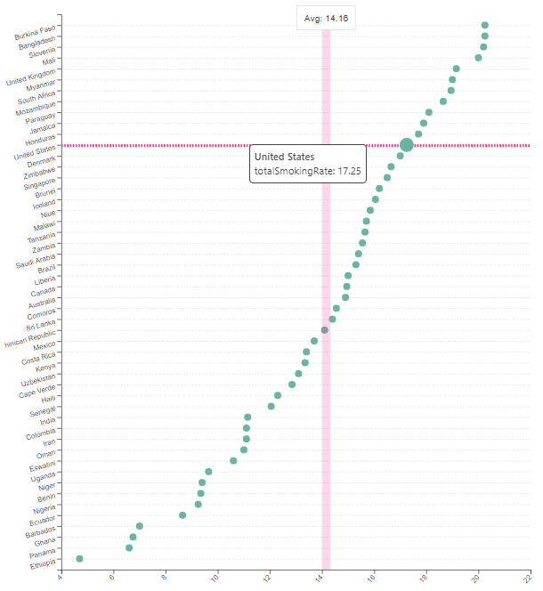
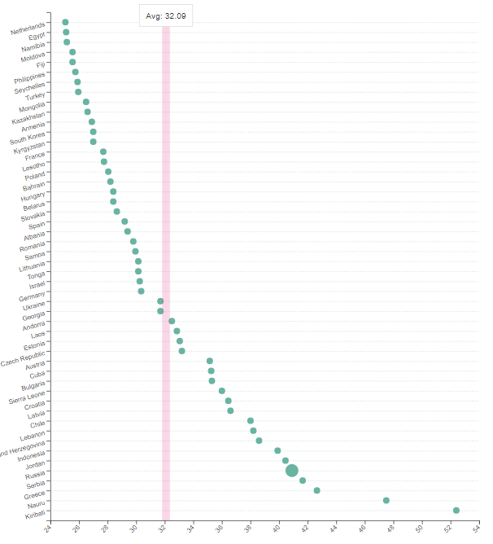

```{r setup, include=FALSE}
knitr::opts_chunk$set(echo = TRUE)
library(tidyverse)
library(gapminder)
```

<!-- This template is intended to help you structure your report. Remove placeholders like this and make it your own. Not every question needs to be answered for every project, and some projects will have additional questions. -->

## Overview

Original visualization:

```{r original-plot, echo=FALSE}
# Here is an example of how to include graphics in your report.
# See https://bookdown.org/yihui/rmarkdown-cookbook/figure-size.html for more details.
# You can use a URL ("Copy Image Address" etc.) or a file in your repo.
 

```

Claim:

> The tobacco prevalence  is affected by several factors. Properity is the first of these. Wealthier countries tend to smoke more. Certain religions such as Christianity and Judaism, are anti-tobacco. 


## Design

<!-- What overall type of visualization was chosen? Why might the author have chosen it? --> It seems like a scatter plot was used in this original visualization. Since there are over a hundred countries listed in the data set, the author may have thought the scatter plot is the best plot to represent numerous rows. 
<!-- What variables are being shown? --> The author could have labeled the country names on the x-axis, but to make it a easier to view, I think he or she labeled the country names on the y-axis and the total smoking rate on the x-axis. 
<!-- What retinal variables and/or aesthetics were chosen to represent those data variables? --> The dots or the points are presented in green and there are no specific size is assigned. When the viewer moves the cursor on a certain point, the total rate of that country shows up. The author also used lines in the background so that it is easy to follow which point belongs to which country. 
<!--     For at least one of these variables, describe what makes that choice appropriate or inappropriate. --> The author used all the country names in the plot. I think there could be an adjustment here. Although these country names are appropriate variables to use, there are too many to of them to show in one plot. Thus, I think we can reduce some countries, for example, filtering only the OECD countries. 
<!-- Overall, what about the visual makes it effective, or ineffective, for making its claim? --> The claim is clear and straightforward, but the visualization is not very effective. We can barely find any association between its claim and its visualization. For example, the original visualization does not really show how economic status or the religion of a country has affect on the smoking rate. 


## Data

### Data Overview

<!-- Whether you were able to find the original data (if not, why not?) --> I was able to find the original data, and found couple other data sets to join gdp and religion into the original data set. 
<!-- Where the data came from --> The data sets of smoking rate came from the website which can be downloaded as a csv file: 
<!--     Direct URL and/or specific instructions for how to obtain it. --> https://worldpopulationreview.com/country-rankings/smoking-rates-by-country
<!--     Under what terms is the source allowing you to use the data? --> This website allows anyone to download the data because this website provides open databases of various research on the world population. 
<!--     Try to trace it upstream as close to the source as you can. --> 
<!--     Who worked with the data on its way to you? (Include names and roles, if applicable.) -->
<!--     What processing may have happened to it: was it aggregated? Anonymized? etc. --> The data seems to be a single file with no aggregation with other files. Furthermore, no personal information was stored in the data set. 
<!-- What might we need to know about the data collection process in order to interpret the data correctly? (e.g., If it’s from a survey–who was surveyed?) --> We may need to include all the data. There should not be any biased action during the data collection process. After all the data is collected, then we can manipulate the data. For example, using left_join or inner_join to filter any unmatching or missing data. 

### Data Details

<!-- A low-level description of the size and structure of the data (include your data-loading code here) --> 
<!-- What does each row represent? --> For smoking and gdp, each row represents country names in their initials. For religion, each row represents country names in their full names. 
<!-- How many rows are there? (use inline code: `r nrow(data)` etc.) --> nrow(smoking) = 115, nrow(gdp) = 115, nrow(religion) = 228
<!--   What might be interesting to know about what information the data does, and doesn’t, provide? --> The religion data set may be interesting to know whether or not the dominant religion of a certain country has affect on the smoking rate. 

```{r load-data}
# your code to load the data here
smoking <- read_csv('world_smoking.csv')
nrow(smoking)
gdp <- read_csv('world_smoking.csv')
nrow(gdp)
religion <- read_csv('world_religion.csv')
nrow(religion)
```

### Wrangling

<!-- Describe, at a broad level, what you need to do to the data to make it into the form you need for the plot. -->

<!-- Add code blocks, with appropriate names, for wrangling steps. -->

## Replication

<!-- Include your code to replicate the visual, and the result. -->
<!-- Briefly describe any difficulties you encountered, both those you overcame and those you still have not. -->
<!-- It’s ok to not have a perfect graph here. If the essential structure is there, don’t worry if the details are a bit different. Focus your attention on making an interesting and polished alternative design. -->

## Alternatives

### Design

<!-- Describe at least two alternative design choices that could be made in visualizing your data. For each design, include: -->
<!--     What choice did the original visual make? (e.g., to use a particular aesthetic mapping or glyph) -->
<!--     What’s an alternative choice? (It should be a reasonable choice, but it doesn’t have to be an improvement.) -->
<!--     How does that change affect how the visual supports the original claim? Can your redesign now support some different claim? -->

### Implementation

<!-- Make a solid attempt to implement your best alternative design. -->
<!--     If creating it using ggplot/plotly/etc is too challenging, you may include a high-fidelity sketch of what the plot would look like (using PowerPoint or a vector graphics tool), along with a clear description of what you’d need to figure out in order to produce it with code. -->

## Summary

<!-- Now that you’ve gone through the whole process, how has your understanding of, and belief in, the original article’s claim changed? -->
<!-- How faithful was your replication? -->
<!-- How successful was your alternative design? -->
<!-- What follow-up questions and ideas do you have about the data or visualization you worked with? -->
<!-- What opportunities do you see for extending this work into a final project? e.g., is there some way you could apply predictive modeling? Get better data? Do a more rigorous analysis? etc. “This seems like a dead end” is valid. -->
<!-- How do you feel about this whole experience? -->
